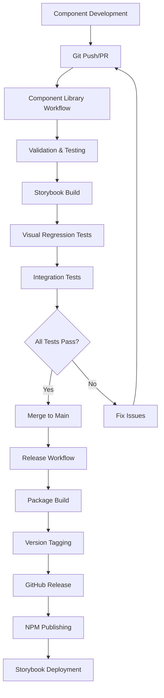

# 🧩 AfriPay Component Library Git Pipeline

A comprehensive Git-based automation system for managing, testing, and distributing the AfriPay React component library.

## 🎯 Pipeline Overview

The component library Git pipeline provides end-to-end automation for:

- **Component Development**: Automated creation, validation, and testing
- **Quality Assurance**: TypeScript validation, accessibility testing, visual regression
- **Documentation**: Automated Storybook builds and component documentation
- **Distribution**: Package creation, versioning, and release management
- **Integration**: Seamless integration with main application development

## 🔄 Pipeline Architecture



## 📋 Workflow Triggers

### 1. Component Library Workflow
**File**: `.github/workflows/component-library.yml`

**Triggers**:
- Push to branches: `main`, `develop`, `feature/component-*`
- Changes in paths: `client/src/components/**`, `.storybook/**`
- Pull requests to `main` or `develop`
- Manual workflow dispatch

**Actions**:
- Component validation and structure checking
- TypeScript compilation and linting
- Unit and accessibility testing
- Storybook building and testing
- Visual regression testing with Playwright
- Component integration testing

### 2. Component Release Workflow
**File**: `.github/workflows/component-release.yml`

**Triggers**:
- Push to tags: `component-v*`
- Published releases
- Manual workflow dispatch with version bumping

**Actions**:
- Pre-release validation
- Library package building
- Multi-node version testing
- GitHub release creation
- NPM package publishing (optional)
- Storybook deployment to GitHub Pages

## 🛠️ Development Workflow

### Creating New Components

#### Option 1: Manual Git Workflow
```bash
# Create feature branch
git checkout main
git pull origin main
git checkout -b feature/component-payment-button

# Generate component using CLI
npm run component:create PaymentButton

# Implement component
# Edit client/src/components/PaymentButton/PaymentButton.tsx
# Edit client/src/components/PaymentButton/PaymentButton.stories.tsx
# Edit client/src/components/PaymentButton/PaymentButton.test.tsx

# Commit changes
git add client/src/components/PaymentButton/
git commit -m "feat(components): add PaymentButton component"

# Push and create PR
git push -u origin feature/component-payment-button
```

#### Option 2: Automated Pipeline Script
```bash
# Create component with automated Git workflow
./scripts/component-library-pipeline.sh create --component PaymentButton --auto-push

# This automatically:
# - Creates feature branch
# - Generates component files
# - Commits changes
# - Pushes branch
# - Triggers CI pipeline
```

### Updating Existing Components

```bash
# Update component with pipeline integration
./scripts/component-library-pipeline.sh update --component WalletCard

# Or manually:
git checkout feature/component-wallet-card
# Make changes
git add . && git commit -m "feat(components): enhance WalletCard accessibility"
git push origin feature/component-wallet-card
```

### Component Validation

```bash
# Validate entire component library
./scripts/component-library-pipeline.sh validate

# Or specific component
npm test -- --testPathPattern=PaymentButton
npm run component:validate
```

## 🚀 Pipeline Jobs Breakdown

### Job 1: Component Validation
**Duration**: ~3-5 minutes

```yaml
Steps:
✅ Checkout repository
✅ Setup Node.js environment
✅ Install dependencies
✅ Detect component changes
✅ Validate component structure
✅ Run TypeScript validation
✅ Run component linting
✅ Run unit tests with coverage
✅ Upload test coverage artifacts
```

**Validation Checks**:
- Component file structure (`.tsx`, `.stories.tsx`, `.test.tsx`)
- TypeScript compilation without errors
- ESLint compliance with zero warnings
- Unit test coverage thresholds
- Accessibility test compliance

### Job 2: Storybook Build & Test
**Duration**: ~4-6 minutes

```yaml
Steps:
✅ Build Storybook static files
✅ Start Storybook server
✅ Test story rendering
✅ Generate component documentation
✅ Upload Storybook artifacts
✅ Upload documentation
```

**Outputs**:
- Static Storybook build
- Component documentation
- Component usage examples
- Interactive story testing results

### Job 3: Visual Regression Testing
**Duration**: ~5-8 minutes

```yaml
Steps:
✅ Download Storybook build
✅ Install Playwright with browsers
✅ Start static Storybook server
✅ Run visual regression tests
✅ Compare screenshots
✅ Upload test results
```

**Testing**:
- Screenshot comparison across components
- Multiple browser testing (Chromium, Firefox, Safari)
- Mobile and desktop viewport testing
- Dark/light theme validation

### Job 4: Integration Testing
**Duration**: ~3-4 minutes

```yaml
Steps:
✅ Build main application
✅ Test component integration
✅ Test component CLI tools
✅ Validate exports and imports
```

### Job 5: Package Publishing (Release Only)
**Duration**: ~2-3 minutes

```yaml
Steps:
✅ Create library package structure
✅ Build TypeScript declarations
✅ Generate package.json
✅ Create documentation
✅ Test package installation
✅ Upload to artifacts/NPM
```

## 📦 Release Process

### Automatic Release (Tag-based)
```bash
# Create and push tag
git tag component-v1.2.3
git push origin component-v1.2.3

# This triggers:
# 1. Component Release Workflow
# 2. Pre-release validation
# 3. Library package build
# 4. Multi-version testing
# 5. GitHub release creation
# 6. NPM publishing (if configured)
# 7. Storybook deployment
```

### Manual Release (Workflow Dispatch)
```bash
# Go to GitHub Actions → Component Library Release
# Select "Run workflow"
# Choose version bump: patch/minor/major
# Enable/disable Storybook deployment
# Click "Run workflow"
```

### Pipeline Script Release
```bash
# Publish using pipeline script
./scripts/component-library-pipeline.sh publish

# This creates:
# - dist/library/ with complete package
# - TypeScript declarations
# - Documentation
# - Ready for NPM publishing
```

## 🔍 Quality Assurance

### Automated Testing Matrix

| Test Type | Tool | Coverage | Trigger |
|-----------|------|----------|---------|
| **Unit Tests** | Jest + RTL | Component logic | Every push |
| **Accessibility** | jest-axe | WCAG AAA | Every push |
| **Visual Regression** | Playwright | UI consistency | PR + main |
| **Type Safety** | TypeScript | Type checking | Every push |
| **Integration** | Custom scripts | App compatibility | Every push |
| **Performance** | Lighthouse | Load times | Release only |

### Quality Gates

Components must pass all quality gates before merging:

✅ **Structure Validation**: Required files present  
✅ **TypeScript Compilation**: Zero errors  
✅ **Unit Test Coverage**: >80% coverage  
✅ **Accessibility Compliance**: Zero violations  
✅ **Visual Consistency**: No regression  
✅ **Integration Success**: App builds successfully  

## 📊 Pipeline Analytics

### Key Metrics Tracked

- **Component Count**: Total components in library
- **Test Coverage**: Percentage coverage across tests
- **Build Time**: Pipeline execution duration
- **Package Size**: Library bundle size
- **Accessibility Score**: WCAG compliance percentage
- **Visual Regression**: Screenshot diff count

### Pipeline Artifacts

Generated artifacts for each run:

| Artifact | Description | Retention |
|----------|-------------|-----------|
| `component-coverage` | Test coverage reports | 7 days |
| `storybook-build` | Static Storybook files | 7 days |
| `component-docs` | Generated documentation | 7 days |
| `visual-test-results` | Screenshot comparisons | 7 days |
| `component-library-package` | NPM package | 30 days |

## 🚀 Usage Examples

### Installing Released Package

```bash
# Install specific version
npm install @afripay/component-library@1.2.3

# Install latest
npm install @afripay/component-library@latest
```

### Using Components

```tsx
// Import components from published library
import { 
  PaymentButton, 
  WalletCard, 
  TransactionItem,
  QRCodeGenerator 
} from '@afripay/component-library';

function MyApp() {
  return (
    <div>
      <WalletCard 
        balance="1,234.56" 
        currency="USD"
        type="primary" 
      />
      <PaymentButton 
        variant="primary"
        onClick={handlePayment}
      >
        Send Money
      </PaymentButton>
    </div>
  );
}
```

### Component Development

```tsx
// Creating new component with pipeline integration
// File: client/src/components/CryptoCard/CryptoCard.tsx

import { FC } from 'react';
import { Card } from '../ui/card';

interface CryptoCardProps {
  symbol: string;
  balance: string;
  usdValue: string;
  change24h: number;
  className?: string;
}

export const CryptoCard: FC<CryptoCardProps> = ({
  symbol,
  balance,
  usdValue,
  change24h,
  className
}) => {
  const isPositive = change24h >= 0;
  
  return (
    <Card className={className}>
      <div className="flex justify-between items-center">
        <div>
          <h3 className="font-semibold">{symbol}</h3>
          <p className="text-sm text-muted-foreground">{balance}</p>
        </div>
        <div className="text-right">
          <p className="font-medium">{usdValue}</p>
          <p className={`text-sm ${isPositive ? 'text-green-600' : 'text-red-600'}`}>
            {isPositive ? '+' : ''}{change24h.toFixed(2)}%
          </p>
        </div>
      </div>
    </Card>
  );
};
```

## 🔧 Pipeline Configuration

### Environment Variables

```yaml
# Component Library Workflow
NODE_VERSION: '20.x'
STORYBOOK_PORT: 6006
COMPONENT_LIBRARY_VERSION: '1.0.0'

# Component Release Workflow
REGISTRY_URL: 'https://registry.npmjs.org'
```

### Required Secrets (for NPM Publishing)

```yaml
# Repository Settings → Secrets
NPM_TOKEN: # NPM authentication token
GITHUB_TOKEN: # Automatically provided
```

### Branch Protection Rules

```yaml
# Recommended settings for main branch
main:
  required_status_checks:
    - Component Validation
    - Storybook Build
    - Visual Regression Tests
    - Integration Tests
  enforce_admins: true
  required_pull_request_reviews:
    required_approving_review_count: 1
    dismiss_stale_reviews: true
```

## 🎯 Best Practices

### Component Development

1. **Follow naming conventions**: PascalCase for components
2. **Include accessibility**: ARIA labels, keyboard navigation
3. **Write comprehensive tests**: Unit, accessibility, visual
4. **Document with stories**: Multiple examples and use cases
5. **Type everything**: Full TypeScript coverage
6. **Mobile-first design**: Responsive by default

### Git Workflow

1. **Use feature branches**: `feature/component-{name}`
2. **Atomic commits**: One feature per commit
3. **Descriptive messages**: Follow conventional commits
4. **Test before pushing**: Run validation locally
5. **Small PRs**: Easy to review and test
6. **Clean history**: Squash when merging

### Pipeline Optimization

1. **Cache dependencies**: NPM cache for faster builds
2. **Parallel jobs**: Run tests concurrently
3. **Artifact reuse**: Share builds between jobs
4. **Smart triggers**: Only run on relevant changes
5. **Fast feedback**: Critical tests first

## 🚀 Deployment Options

### GitHub Pages (Storybook)
- Automatic deployment on main branch
- URL: `https://afripay.github.io/storybook/`
- Contains interactive component documentation

### NPM Registry
- Automated publishing on release
- Package: `@afripay/component-library`
- Semantic versioning with automated bumping

### Private Registry
- Can be configured for internal distribution
- Supports scoped packages
- Authentication via NPM tokens

## 📈 Monitoring & Analytics

### Pipeline Health
- Success rate tracking
- Build time monitoring
- Test coverage trends
- Package size tracking

### Component Usage
- Download statistics
- Version adoption
- GitHub stars/forks
- Issue tracking

---

This Git pipeline provides a complete automation solution for component library development, ensuring quality, consistency, and reliable distribution across the AfriPay ecosystem.